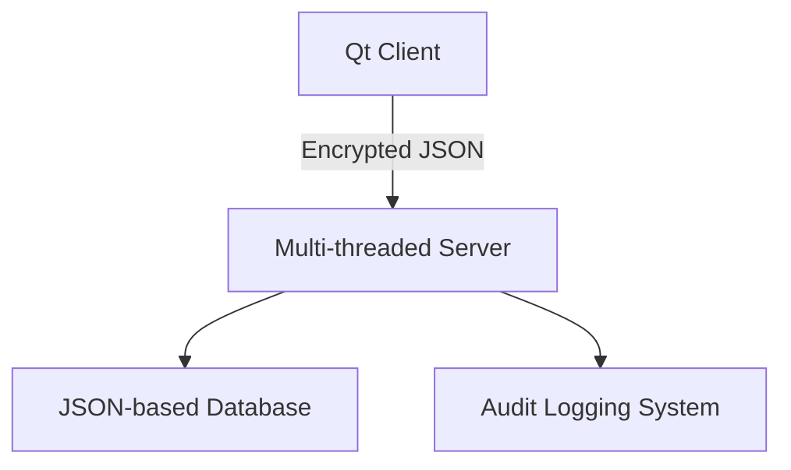
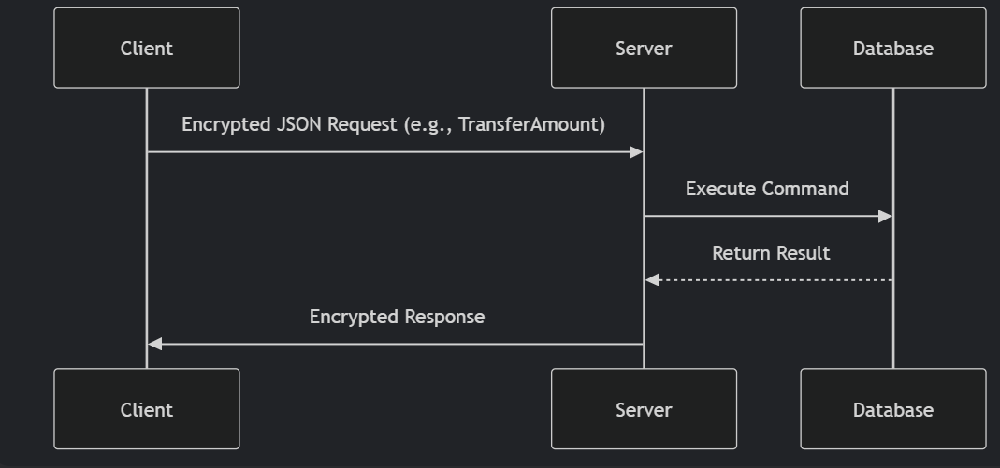
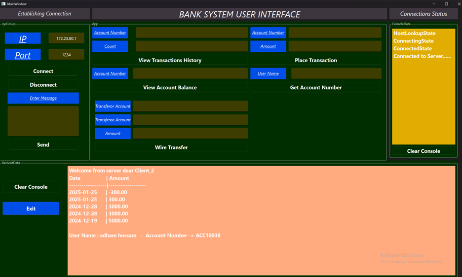
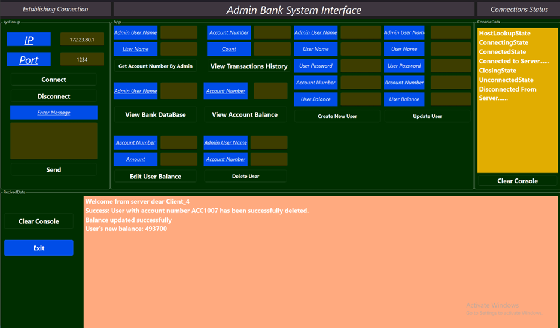

# DistributedBankSystem-Qt

A secure and efficient client-server banking platform built using Qt/C++ with real-time operations, role-based access, and encrypted communication.
---

## 🚀 Key Features

### 🔐 Security

* XOR-based encryption for safe client-server communication
* Role-based access: Admin and User modes
* Secure audit logging in JSON format

🌐 WebSocket Integration
(Secure real-time updates alongside traditional TCP)

Key Features

Bi-directional Push Notifications

Balance updates

Transaction confirmations

Admin alerts (new user registrations)

Enhanced Security

Same XOR encryption as TCP channel

Per-connection origin verification

Automatic heartbeat (ping/pong)

### ⚡ Performance

* Multi-threaded backend server for concurrency
* Handles multiple client requests simultaneously
* Supports TCP and WebSockets for flexible communication

### 💻 User Interfaces

* **Qt GUI Client**: Login, balance checks, money transfers
* **Admin Dashboard**: Manage user accounts, transactions, and system logs
* **Server CLI**: Monitor requests and logs in real-time

---

## 🏗️ System Architecture

🛠️ Technical Design

 

Uses QTcpSocket with XOR encryption

Key Classes
Class	Responsibility
Client	Handles encrypted requests/responses
Server	Manages multi-threaded client sessions
RequestProcessor	Executes commands via registry pattern
BankDatabase	Singleton JSON database manager

## 🧰 Getting Started

### 📦 Prerequisites

* Qt 6.4 or later

### 🔧 Build Instructions

just git clone repos

open the pro file of networkclient

open the pro file of bankserver
make sure to change the path in bankdatabase.cpp
QObject{parent} , Path("D://Embdedd Linux//QT//QT-WORK//Bank_Managemnet_System_using_WebSockets//BankServer//BankDatabase.json")
Path
make sure the path fits your System filesystem

after wards just open the client and connect using the ip of your machine and port number to the server(which listens on port 1234) which has all the data 

### ▶️ Run

## 🖼️ Screenshots

| Login Page                | User Dashboard          | Admin Panel               |
| ------------------------- | ----------------------- | ------------------------- |
|  |  |  |

---

## 📄 Documentation

* [📘 Full Project Report (PDF)](docs/Final Graduation Project Documentation.pdf)
* [📊 Database Schema](images/Database_schema.png)

---

## 📜 License

MIT License © 2024 \[Mohamed Dewidar]

---

## 📌 Notes

* Update the `media/` paths to your actual screenshot paths
* Replace placeholders like `[Mohamed Dewidar]` if needed
* Add additional performance metrics and test cases in `docs/`
