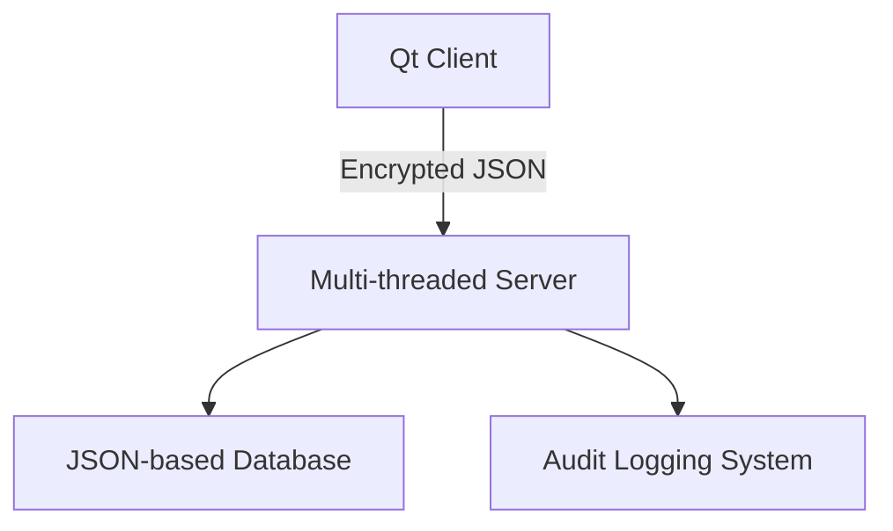

# DistributedBankSystem-Qt

A secure and efficient client-server banking platform built using Qt/C++ with real-time operations, role-based access, and encrypted communication.
---

## 🚀 Key Features

### 🔐 Security

* XOR-based encryption for safe client-server communication
* Role-based access: Admin and User modes
* Secure audit logging in JSON format

🌐 WebSocket Integration
(Secure real-time updates alongside traditional TCP)

Key Features

Bi-directional Push Notifications

Balance updates

Transaction confirmations

Admin alerts (new user registrations)

Enhanced Security

Same XOR encryption as TCP channel

Per-connection origin verification

Automatic heartbeat (ping/pong)

### ⚡ Performance

* Multi-threaded backend server for concurrency
* Handles multiple client requests simultaneously
* Supports TCP and WebSockets for flexible communication

### 💻 User Interfaces

* **Qt GUI Client**: Login, balance checks, money transfers
* **Admin Dashboard**: Manage user accounts, transactions, and system logs
* **Server CLI**: Monitor requests and logs in real-time

---

## 🏗️ System Architecture

🛠️ Technical Design

 

Uses QTcpSocket with XOR encryption

Key Classes
Class	Responsibility
Client	Handles encrypted requests/responses
Server	Manages multi-threaded client sessions
RequestProcessor	Executes commands via registry pattern
BankDatabase	Singleton JSON database manager

🧰 Getting Started
📦 Prerequisites
Qt 6.4+ (with WebSockets module)

Git (for cloning repository)

🔧 Build & Setup
Clone Repository:

git clone https://github.com/Mohamed-Magdy-Dewidar/DistributedBankSystem-Qt.git

cd DistributedBankSystem-Qt

Configure Database Path:
Edit BankServer/BankDatabase.cpp:

cpp
// Replace with your absolute path
Path("/path/to/BankDatabase.json"); 
Example for Windows:

cpp
Path("C:/Dev/BankSystem/BankServer/BankDatabase.json");
Build Projects:

# Build Server
cd BankServer
Open the .pro File and Build and run the Project and it automatically listens to port 1234 Default TCP mode (port 1234)

# Build Client
cd ../NetworkClient
Open the .pro File and Build and run the Project and it connect to the server using the ip of your machine and port

### ▶️ Run
after build the project just run the bankserver and networkClient as separate project 

## 🖼️ Screenshots

| Login Page                | User Dashboard          | Admin Panel               |
| ------------------------- | ----------------------- | ------------------------- |
|  |  |  |

---

## 📄 Documentation

* [📘 Full Project Report (PDF)](docs/Final Graduation Project Documentation.pdf)
* [📊 Database Schema](images/Database_schema.png)

---

## 📜 License

MIT License © 2024 \[Mohamed Dewidar]

---

## 📌 Notes

* Update the `media/` paths to your actual screenshot paths
* Replace placeholders like `[Mohamed Dewidar]` if needed
* Add additional performance metrics and test cases in `docs/`
